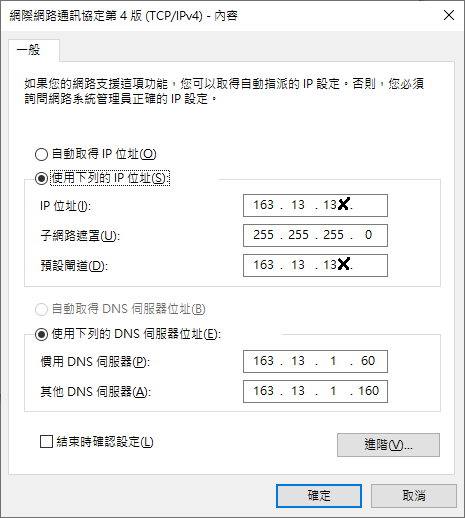

# \[必讀\] 網路修繕注意事項

* 一般而言先檢查**固定IP**是否設定有問題，本系IP配置一般而言遵守下方規則。

* 若固定IP不可使用且檢查沒問題時，需檢查Switch綁定是否跑掉，若跑掉重新設回即可。
* 系辦印表機大台的有專門的廠商處裡，僅需紀錄IP及MAC，確認是否有跑掉即可。
*  無線基地台\(簡稱AP\)的設定較為繁瑣，需進行詳細確認，若無法設定，一般AP後方配有重置按鈕\(reset\)，可在重置後重新設定。

### 若遭遇自行無法處理之網路問題，可與淡江大學網路管理組張錦玲、王裕仁承辦人聯繫並請求協助。

### 非自身了解之指令，建議架設測試伺服器進行練習，切勿於系上設備執行測試操作，以免造成資料損毀等問題。

