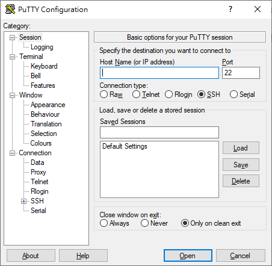

# DNS Server操作介紹

網域名稱系統（英語：Domain Name System，縮寫：**DNS**）是網際網路的一項服務。 它作為將域名和IP位址相互對映的一個分散式資料庫，能夠使人更方便地存取網際網路。  
實際舉例：本系系網頁為163.13.132.45，域名為www.ee.tku.edu.tw，當於瀏覽器網址列則一進行輸入時，皆會連結之本系系網頁。

www.ee.tku.edu.tw指向到163.13.132.45稱之為正解  
163.13.132.45指向到www.ee.tku.edu.tw稱之為反解  
因此，若想讓使用者在打網址時，能尋找到正確的伺服器，就必須在正解部分進行設定。

#### 注意：雖然正反解設定時會同時進行，但正反解也可以獨立存在，意指可單獨設定正解或反解。

於Windows查詢正反解時，可使用命令提示字元內部之nslookup指令。

```text
C:\Users\xxx>nslookup 163.13.132.45   //利用nslookup查看IP 163.13.132.45
伺服器:  tkurs1.tku.edu.tw
Address:  163.13.1.60

名稱:    www.ee.tku.edu.tw            //系統告知其指向至www.ee.tku.edu.tw
Address:  163.13.132.45
```

本系所管理之DNS Server 為 ee.tku.edu.tw，設定時僅可設定此網域下層網域。  
實際舉例：  
www.ee.tku.edu.tw 為本系系網頁，是在DNS Server中設定 www 指向至 163.13.132.45。  
\*\*webmail.ee.tku.edu.tw 為本系信郵件伺服器。

使用SSH連線\(Putty\)進行設備操作



#### 注意：此為Linux系統，因此操作時必須先知曉簡單的Linux指令。

由於涉及安全性，以下教學不附圖檔，請自行在需要時練習。  


#### 本教學使用vim編輯器進行編輯，因此在執行前請**務必熟記vim指令**，以免產生無法出編輯器或刪資料的問題。

Vim 主要是使用模式的切換來進行輸入、移動游標、選取、複製及貼上等操作。在 Vim 主要常用的有幾個模式：Normal 模式以及 Insert 模式：

1. Normal 模式，又稱命令模式，在這個模式下，無法輸入文字，僅能進行複製、貼上、存檔或離開動作。
2. 要開始輸入文字，需要先按下 `i`、`a` 或 `o` 這三個鍵其中一個進入 Insert 模式，便能開始打字。其中，`i` 表示 `insert`，`a` 表示 `append`，而 `o` 則是表示會新增一行並開始輸入。
3. 在 Insert 模式下，按下 `ESC` 鍵或是 `Ctrl + [` 組合鍵，可退回至 Normal 模式。
4. 在 Normal 模式下，按下 `:w` 會進行存檔，按下 `:q` 會關閉這個檔案（但若未存檔會提示先存檔再離開），而 `:wq` 則是存檔完成後直接關閉這個檔案。

```text
#vim /var/cache/bind/named.hosts      //正解設定

#vim /var/cache/bind/132.rev(133.rev) //反解設定
```

DNS在設定完畢後務必進行重新啟動，重新啟動後邦定之正反解最快將於半小時後生效。

```text
#sudo service bind9 restart             //重新啟動設備之指令
```

