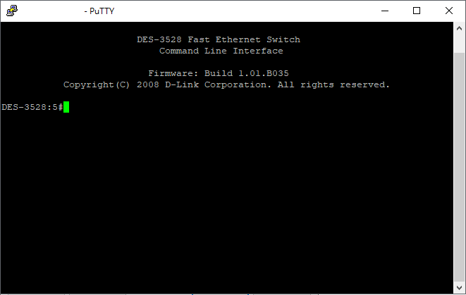
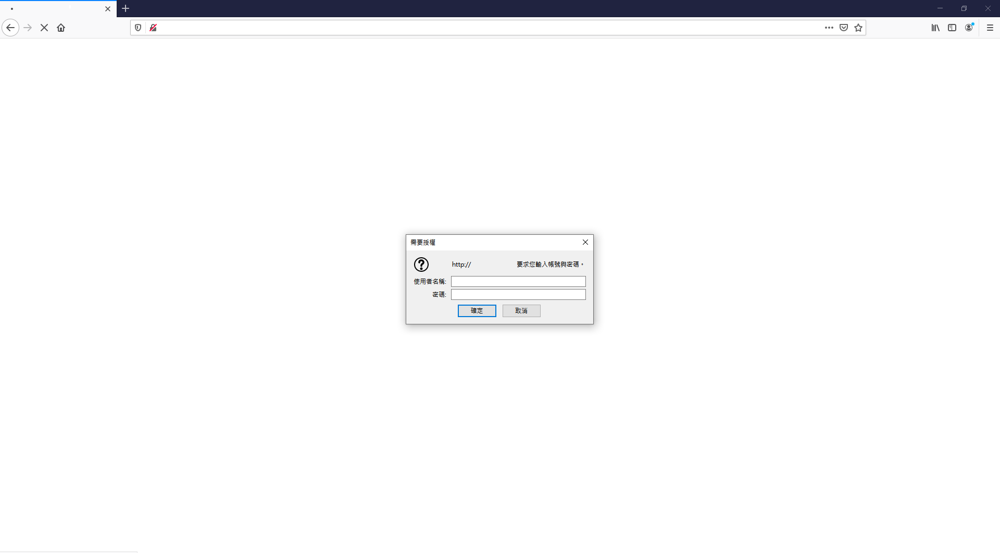
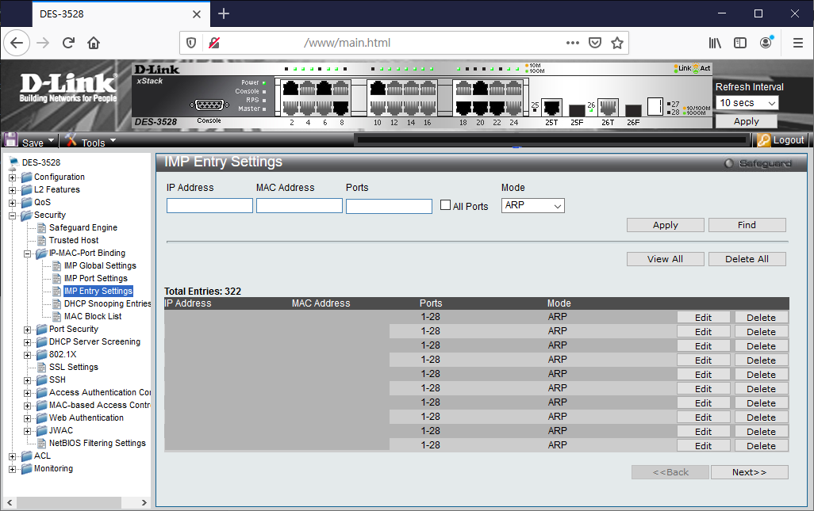

# Switch操作介紹

#### DES-3528為網路組分配本系之網路交換器\(switch\)，本系配有兩台可進行該操作之設備，系上任何固定IP進行使用皆須至此進行設定。

目前設定2、3樓為132設備，5、6樓為133設備，但有例外，若網路出現問題需要重複確認。

目前分為SSH連線\(推薦Putty\)及網頁連線\(推薦Firefox瀏覽器\)  
Putty連線缺點：字元限制因此無法有效進行IPMAC綁定\(溢出字元問題\)  
網頁連線缺點：存檔及備份無法有效執行\(目前尚不知原因\)  


#### 建議操作模式：於網頁設定完畢IPMAC後，至SSH連線進行存檔及備份指令 

Putty下載請點[這裡](https://www.putty.org/)，當初下載版本putty-64bit-0.70-installer.msi，若連結失效請自行搜尋。  
開啟Putty，選擇SSH連線後輸入本系網路交換器IP。


登入使用者後可進行其他操作。

#### 注意：連線後刪除鍵為Ctrl+h，尚未了解如何操作時請勿任意更換設置。



網路交換器常見的操作有查看使用者IPMAC綁定狀況、MAC綁定、存檔、備份四種。  
使用TAB鍵可切換並查找該層級中需要的指令

```text
#show address_binding ip_mac all

*************************
**查看使用者IP_MAC綁定狀況**
*************************

#config address_binding ip_mac ipaddress <輸入待綁定之IP> <輸入待綁定設備MAC>

**************
**MAC綁定指令**
**************

#save all

***********
**存檔指令**
***********

#upload cfg_toTFTP <備份設備> <檔名:請遵照檔案格式>

***********
**備份指令**
***********
```

當出現問題時\(例：斷電\)，主機會自動搜尋暫存檔，若遭受無法自行操作修復之問題時，則利用還原指令。

```text
download cfg_fromTFTP <備份設備> <檔名:請遵照檔案格式>

***********
**還原指令**
***********
```

瀏覽器操作請使用Firefox設備進行，輸入特定IP後可進行練線。



#### 注意：在不確定頁面操作方式時，請勿任意更換設定。

登入後可進入WEB操作模式進行MAC綁定操作\(左方為IPMAC綁定頁面之樹狀圖展開位置\)。



