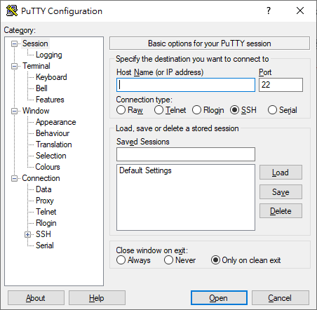

# Mail Server操作介紹

本系使用之Mail Server，是基於 OpenWebMail 系統所建立而成，目前已較少老師使用。  
此項目可搭配該網頁進行查看[http://linux.vbird.org/linux\_basic/0420quota/0420quota-fc4.php\#edquota](http://linux.vbird.org/linux_basic/0420quota/0420quota-fc4.php#edquota)  
  
使用SSH連線\(Putty\)進行設備操作



目前較常需要處理之問題為信箱超出容量，因此需針對該名老師之信箱進行磁碟配額增加\(Quota\)

```text
# quota -u <username>                  //查看特定使用者磁碟配額情況

Disk quotas for user <username> (uid xxxx):
    Filesystem  blocks   quota   limit   grace   files   quota   limit   grace
     /dev/sdb1   16508  215040  225280              19       0       0
```

若有老師反映信箱無法收信，大概率是信箱容量超出因此無法繼續收信，此時使用edquota指令進行配額增加即可。

#### 注意：使用edquota時，會進入vi編輯器，此時僅需要針對quota及limit進行設置即可。

quota:磁碟配額 limit:最高上限

若有新進教授需使用該Mail Server，則使用_adduser_指令執行，但因目前該設備正討論是存廢，在此不建議繼續新增使用者。

另外Mail Server有兩套廣告性操作系統

1. procmail  設定rule阻擋用 設定rule位置: /etc/procmailrc
2. spamassain 用評分機制 /etc/mail/spamassassin

