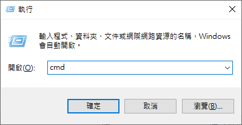

# 網路基本操作

#### win+r 鍵可開啟"執行"視窗，輸入cmd後開啟命令提示字元介面



#### 執行 ipconfig /all 可查看該主機連線狀況及主要網路設置

```
C:\Users\xxx>ipconfig /all

Windows IP 設定

   主機名稱 . . . . . . . . . . . . .: DESKTOP-3LCGFV6
   主要 DNS 尾碼  . . . . . . . . . .:
   節點類型 . . . . . . . . . . . . .: 混合式
   IP 路由啟用 . . . . . . . . . . . : 否
   WINS Proxy 啟用 . . . . . . . . . : 否

乙太網路卡 乙太網路:

   連線特定 DNS 尾碼 . . . . . . . . :
   描述 . . . . . . . . . . . . . . .: Intel(R) Ethernet Connection (2) I219-V
   實體位址 . . . . . . . . . . . . .: 2C-4D-54-E9-09-B1
   DHCP 已啟用 . . . . . . . . . . . : 否
   自動設定啟用 . . . . . . . . . . .: 是
   連結-本機 IPv6 位址 . . . . . . . : fe80::d1cf:c60b:3341:a5bc%8(偏好選項)
   IPv4 位址 . . . . . . . . . . . . : 163.13.132.200(偏好選項)
   子網路遮罩 . . . . . . . . . . . .: 255.255.255.0
   預設閘道 . . . . . . . . . . . . .: 163.13.132.254
   DHCPv6 IAID . . . . . . . . . . . : 53235028
   DHCPv6 用戶端 DUID. . . . . . . . : 00-01-00-01-21-41-B1-33-2C-4D-54-E9-09-B1
   DNS 伺服器 . . . . . . . . . . . .: 163.13.1.60
                                       163.13.1.160
   NetBIOS over Tcpip . . . . . . . .: 啟用
```

#### 執行 ping 指令可察看是否可與外部網路、內部網路進行連線

內部網路示意圖

```bash
C:\Users\xxx>ping 163.13.1.60

Ping 163.13.1.60 (使用 32 位元組的資料):
回覆自 163.13.1.60: 位元組=32 時間<1ms TTL=62
回覆自 163.13.1.60: 位元組=32 時間<1ms TTL=62
回覆自 163.13.1.60: 位元組=32 時間<1ms TTL=62
回覆自 163.13.1.60: 位元組=32 時間<1ms TTL=62

163.13.1.60 的 Ping 統計資料:
    封包: 已傳送 = 4，已收到 = 4, 已遺失 = 0 (0% 遺失)，
大約的來回時間 (毫秒):
    最小值 = 0ms，最大值 = 0ms，平均 = 0ms
```

外部網路示意圖

```bash
C:\Users\xxx>ping 8.8.8.8

Ping 8.8.8.8 (使用 32 位元組的資料):
回覆自 8.8.8.8: 位元組=32 時間=2ms TTL=55
回覆自 8.8.8.8: 位元組=32 時間=2ms TTL=55
回覆自 8.8.8.8: 位元組=32 時間=2ms TTL=55
回覆自 8.8.8.8: 位元組=32 時間=2ms TTL=55

8.8.8.8 的 Ping 統計資料:
    封包: 已傳送 = 4，已收到 = 4, 已遺失 = 0 (0% 遺失)，
大約的來回時間 (毫秒):
    最小值 = 2ms，最大值 = 2ms，平均 = 2ms
```

#### 執行 tracert 指令可追蹤網路如何連接 \(適用於內部檢修\)

```bash
C:\Users\xxx>tracert 163.13.1.60

在上限 30 個躍點上
追蹤 tkurs1.tku.edu.tw [163.13.1.60] 的路由:

  1     1 ms    <1 ms    <1 ms  router.ee.tku.edu.tw [163.13.132.254]
  2     4 ms    <1 ms     1 ms  163.13.135.252
  3     *       <1 ms    <1 ms  tkurs1.tku.edu.tw [163.13.1.60]

追蹤完成。
```


